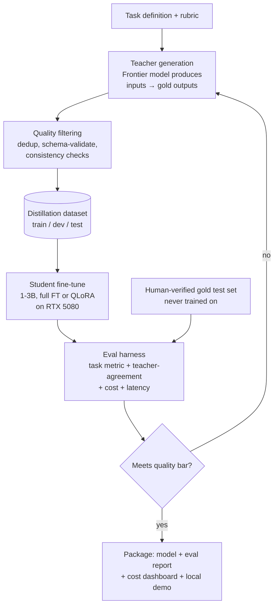
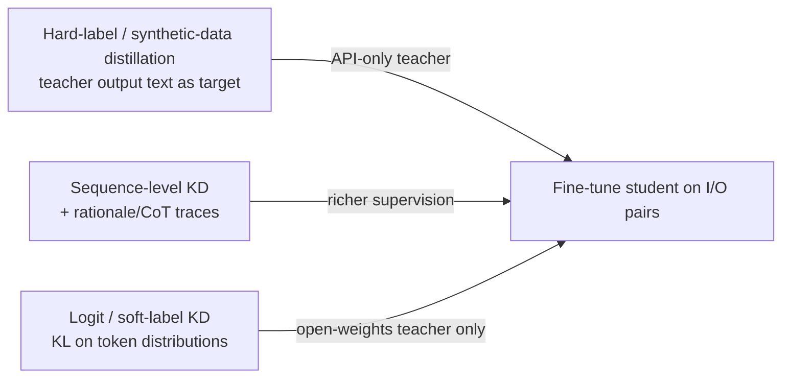

# Project 02 — Task-Distilled Small Model (Frontier Quality, Tiny-Model Cost)

**One-line pitch:** Take one narrow, high-value capability, distill a frontier model's behavior on it into a 1–3B model you can run locally, and prove it matches the teacher at a fraction of the cost — "95% of the quality, 40× cheaper, runs on a laptop."

---

## 0. Honest positioning — read this first

**What already exists:** Knowledge distillation is well-established. Prometheus, JudgeLM, Distil-Whisper, Alpaca/Vicuna-style synthetic-data fine-tunes, and countless task-specific small models exist. So "I distilled a model" is not novel by itself.

**Where the genuine value is (your opening):** The rare, credible artifact is a **rigorous cost/quality case study on a specific, real task** with:
1. A **clean task definition** and a **held-out eval** the small model never trained on.
2. A **measured cost curve** — teacher $/1k calls vs your local model's amortized cost — with latency.
3. **Honest failure analysis** — where the 5% gap is, and whether it matters for the use case.

**The headline is NOT** "small model beats GPT." It is: *"On [specific task], a distilled 3B model reaches Z% of the frontier teacher's quality at ~1/40th the cost and runs on a single consumer GPU — here's the exact recipe and the eval."* Executives feel the cost story; engineers respect the eval. Pick a task where the ROI is obvious.

**Good candidate tasks (pick ONE, narrow):**
- Structured extraction from a document type (invoices, contracts, CVs) → JSON.
- Classification/triage (support ticket routing, intent detection, PII flagging).
- Query rewriting / SQL generation for a fixed schema.
- Domain summarization (e.g., legal clause summaries) with a fixed format.
- **Tie it to a client:** a task one of your clients actually pays per-API-call for.

---

## 1. Problem → Solution

| | |
|---|---|
| **Problem** | Companies want a specific LLM capability in production but can't afford frontier API calls at scale, can't send data to third parties (privacy), or need low, predictable latency. Per-request frontier cost kills the unit economics. |
| **Solution** | Use the frontier model as a *teacher* to generate high-quality labeled data for one task, fine-tune a small *student* (1–3B) to imitate it, and deploy the student locally. Prove parity on a held-out eval and quantify the cost/latency win. |
| **Why it's rare** | Most "small model" demos skip the eval and the cost math. A disciplined teacher→student→**measured** pipeline is exactly the LLMOps competence enterprises pay for. |

---

## 2. Architecture



**Distillation signal options (choose based on access):**


> With API-only frontier teachers you can't get logits — use **synthetic-data / sequence-level distillation** (train on the teacher's outputs, optionally with rationales). Soft-label KL distillation requires an open-weights teacher.

---

## 3. Tech stack & frameworks

| Layer | Choice | Notes |
|---|---|---|
| Teacher | A frontier API model (your choice) or a strong open model (e.g., a 70B) run elsewhere | API-only ⇒ hard-label/sequence-level KD. |
| Student base | **Qwen2.5-1.5B/3B**, **Llama-3.2-1B/3B**, **Phi-3.5-mini**, **Gemma-2-2B** | Pick permissive license + strong base for the task. |
| Fine-tuning | **Unsloth** (fastest on a single consumer GPU) or **TRL SFTTrainer** + **PEFT** | Unsloth gives big VRAM/speed wins for ≤7B on one GPU. |
| Quantized inference | **llama.cpp / Ollama**, **vLLM**, **TGI** | Ollama fits your existing local setup. |
| Data tooling | **datasets**, **pydantic** (schema validation), **jsonschema** | Validate every teacher output before it enters the set. |
| Eval | **lm-evaluation-harness**, task-specific scorers, **Braintrust/promptfoo** for A/B | Report teacher-agreement + task metric. |
| Cost/latency | Simple logging → a small **Streamlit/HTML** dashboard | $/1k calls (teacher) vs kWh/GPU-amortized (student); p50/p95 latency. |
| Tracking | W&B / TensorBoard | |

---

## 4. Datasets & data generation

You *generate* the dataset with the teacher — this is cheaper and more controllable than finding one.

**Generation recipe:**
1. **Seed inputs** — collect or synthesize realistic inputs for the task (real client docs, public samples, or teacher-generated diverse inputs). Diversity matters more than volume.
2. **Teacher outputs** — prompt the teacher with a strong, fixed instruction + few-shot examples + a strict output schema. Ask for rationales if you want CoT distillation.
3. **Filter ruthlessly:**
   - Schema-validate (pydantic/jsonschema) — drop malformed.
   - Dedup (embedding similarity) — avoid near-duplicates inflating the set.
   - Consistency check — sample-run the teacher twice, keep agreeing items, or use a second model as a checker.
4. **Human-verify a gold test set** (a few hundred items) — the small model must *never* train on this. It's your ground truth.

**Scale:** For a narrow task, **2k–20k** clean examples often suffices for a small student. Quality > quantity.

**Legal/ToS note:** Check the teacher provider's terms regarding using outputs to train competing models. Frame this as an internal/task-specific tool and stay within terms; document your compliance stance.

---

## 5. Hardware fit — RTX 5080 (16GB)

| Student size | Approach | Fits 16GB? |
|---|---|---|
| ≤3B | **Full fine-tune** (bf16, grad checkpointing) | ✅ |
| 7–8B | **QLoRA** (4-bit) | ✅ |
| 13B | QLoRA, tight | ⚠️ possible with care |

For a distillation *case study*, a **1–3B full fine-tune** is the sweet spot: fast, cheap, and the "runs on a laptop" story is stronger the smaller you go. Use **Unsloth** to maximize throughput on the single GPU.

**QLoRA reference config (if going 7B):** 4-bit NF4, double quant, LoRA r=16–64, alpha=16–32, target all linear layers, gradient checkpointing, paged AdamW 8-bit, bf16 compute.

---

## 6. Build plan (phased)

### Phase 0 — Define task + bar (day 1)
Write the task spec, the output schema, and the **quality bar** ("student must reach ≥95% of teacher on metric M on held-out test"). Decide the metric now.

### Phase 1 — Generate + filter (week 1)
Teacher generation → validation → dedup → splits + human-verified gold test.

### Phase 2 — Train student (week 2)
```python
# Unsloth SFT skeleton (single 5080)
from unsloth import FastLanguageModel
from trl import SFTTrainer, SFTConfig

model, tok = FastLanguageModel.from_pretrained(
    "unsloth/Qwen2.5-3B", max_seq_length=2048, load_in_4bit=False)  # 3B full FT fits
model = FastLanguageModel.get_peft_model(model, r=0)  # or LoRA for 7B

trainer = SFTTrainer(
    model=model, tokenizer=tok, train_dataset=train_ds,
    args=SFTConfig(per_device_train_batch_size=8, gradient_accumulation_steps=4,
                   learning_rate=2e-5, num_train_epochs=3, bf16=True,
                   gradient_checkpointing=True, logging_steps=20,
                   eval_strategy="steps", eval_steps=200, output_dir="student"))
trainer.train()
```

### Phase 3 — Evaluate (week 2–3)
- Task metric on gold test (exact-match/F1 for extraction, accuracy for classification, etc.).
- **Teacher-agreement** (does student match teacher on unseen inputs?).
- **Cost/latency**: measure teacher $/1k and student throughput; compute break-even volume.

### Phase 4 — Package (week 3)
Model on HF, eval report, cost dashboard, Ollama one-liner to run it, blog post.

---

## 7. Evaluation & metrics

- **Task-native metric** (exact match, F1, schema-valid rate, accuracy) on the human-verified gold set.
- **Teacher-agreement %** on a fresh unseen input pool.
- **Cost model:**

| Metric | Teacher (API) | Student (local, 5080) | Win |
|---|---|---|---|
| $/1k requests | e.g. $X | ~electricity + amortized GPU | e.g. **40×** |
| p95 latency | e.g. 2.1s | e.g. 180ms | lower |
| Data egress | leaves org | stays local | privacy |
| Quality (metric M) | 100% (ref) | e.g. **96%** | acceptable |

- **Failure analysis** — categorize the residual gap; state clearly which cases still need the teacher (you can even route hard cases up — ties into Project on model routing).

---

## 8. Shareable deliverables

1. **HF model** + card (recipe, base, data size, eval table).
2. **Eval report** (notebook or markdown) with task metric + teacher-agreement + cost/latency.
3. **Cost dashboard** — a small interactive page showing break-even volume ("above N requests/day, local wins").
4. **One-command local run** (`ollama run your-model`) + a short demo video.
5. **Blog post**: "How I got frontier-level [task] at 1/40th the cost on a single GPU."

---

## 9. Milestones & timeline

| Week | Milestone |
|---|---|
| 1 | Task spec + generated/filtered dataset + gold test |
| 2 | Student trained, first eval vs bar |
| 3 | Cost/latency measured, package + blog shipped |

---

## 10. Common pitfalls

- **Distilling teacher's mistakes** → filter/verify; don't blindly trust teacher output, especially on edge cases.
- **Train/test leakage** → the gold test must be human-made and never in training; dedupe across splits.
- **Over-narrow eval** → make the test set cover realistic input diversity, not just easy cases.
- **Cost hand-waving** → include *amortized* GPU cost + electricity, not just "it's free locally." Be honest; it still wins at volume.
- **Format brittleness** → enforce schema at inference (constrained decoding / retries) so the small model's occasional format slips don't crash downstream.
- **ToS** → confirm the teacher provider allows training on outputs for your use case.

---

## 11. References

**Concepts / papers**
- Hinton et al., "Distilling the Knowledge in a Neural Network" (soft-label KD).
- Kim & Rush, "Sequence-Level Knowledge Distillation."
- "Prometheus / Prometheus 2" — distilled evaluator precedent (Mistral fine-tunes).
- Alpaca / Vicuna / Self-Instruct — synthetic-data distillation precedent.
- Distil-Whisper — task-specific distillation done well.

**Tools**
- **Unsloth** (efficient single-GPU fine-tuning) — github.com/unslothai/unsloth.
- TRL `SFTTrainer`; 🤗 PEFT (QLoRA).
- vLLM / Ollama / llama.cpp for serving.
- `lm-evaluation-harness`; promptfoo / Braintrust for A/B.
- Candidate bases: Qwen2.5-1.5B/3B, Llama-3.2-1B/3B, Phi-3.5-mini, Gemma-2-2B.

---
*Fits your stack: pairs naturally with your Ollama/local-inference setup and gives clients a privacy-preserving, cheap alternative to frontier APIs. Strong client sales artifact.*
