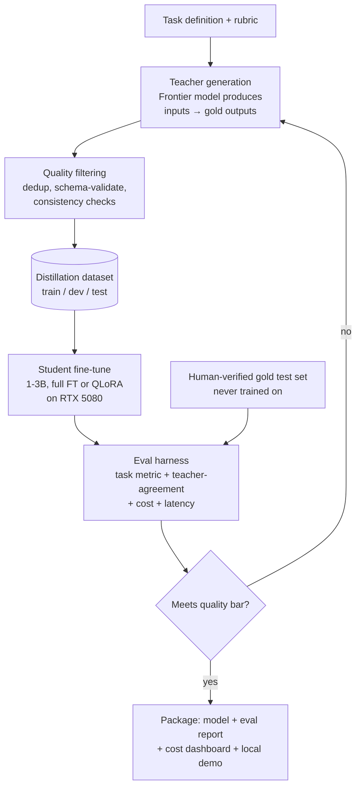
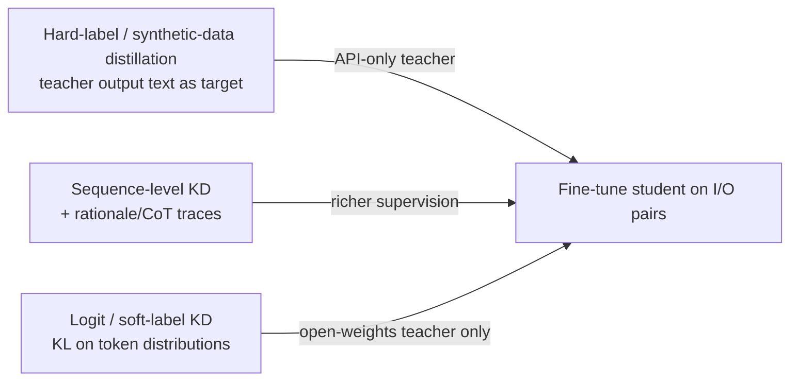

# 02 — Architecture

> The end-to-end teacher → student → measured-eval pipeline, the distillation-signal options, the local inference/deployment path, and the key design decisions with their tradeoffs.

## System overview

The system is a closed loop: a **task definition** drives **teacher generation**, outputs are **quality-filtered** into a **distillation dataset**, a **small student** is fine-tuned on it, an **eval harness** measures task quality + teacher-agreement + cost + latency, and a **quality gate** either sends the pipeline back to generate more/better data or forward to **packaging**. A separate **human-verified gold test set** feeds only the eval — it is never trained on.

### Main pipeline (from SPEC)



### Distillation signal options (from SPEC)



> With API-only frontier teachers you can't get logits — use **synthetic-data / sequence-level distillation** (train on the teacher's outputs, optionally with rationales). Soft-label KL distillation requires an open-weights teacher.

## Component walkthrough

### 1. Task definition + rubric
The single source of intent. Defines the exact narrow task, the **output schema** (e.g., a JSON structure), and the **rubric** the teacher is asked to follow. This artifact is written in Phase 0 and drives everything downstream: the teacher prompt, the schema validator, and the eval metric. A vague task here poisons the whole pipeline.

### 2. Teacher generation
The frontier model (API or a strong open model such as a 70B run elsewhere) produces `input → gold output` pairs. Prompting uses a **strong, fixed instruction + few-shot examples + a strict output schema**, and optionally requests **rationales** when doing CoT / sequence-level distillation. Seed inputs come from real client docs, public samples, or teacher-generated diverse inputs — **diversity matters more than volume**.

### 3. Quality filtering
The gate that stops teacher noise from entering the dataset. Three checks:
- **Schema-validate** every output with `pydantic` / `jsonschema`; drop malformed items.
- **Dedup** using embedding similarity to avoid near-duplicates inflating the set.
- **Consistency check** — sample-run the teacher twice and keep agreeing items, or use a second model as a checker.

### 4. Distillation dataset (train / dev / test)
The curated, validated corpus, split into train / dev / test. Splits must be **de-duplicated across each other** to prevent leakage. This is the *machine-curated* dataset; it is distinct from the human gold set (below).

### 5. Student fine-tune
A 1–3B student is trained on the distillation dataset on the single **RTX 5080 (16GB)**. Approach depends on size: **full fine-tune** for ≤3B (bf16 + gradient checkpointing), **QLoRA (4-bit)** for 7–8B. **Unsloth** maximizes throughput on the single GPU; TRL `SFTTrainer` + PEFT is the alternative. See [07-build-roadmap.md](07-build-roadmap.md) for the training skeleton.

### 6. Eval harness
Measures four things on every candidate student:
- **Task metric M** (exact-match / F1 / schema-valid rate / accuracy) on the human-verified gold set.
- **Teacher-agreement %** on a *fresh, unseen* input pool.
- **Cost** — teacher $/1k vs student amortized $/1k.
- **Latency** — p50/p95 for both.

### 7. Quality gate
A decision node: does the student meet the pre-committed bar (e.g., ≥95% of teacher on M)? **No →** loop back to teacher generation (more/better/more-diverse data). **Yes →** proceed to packaging.

### 8. Human-verified gold test set
A few hundred human-checked items that feed **only** the eval harness. The student must **never** train on this — it is the ground truth that makes the parity claim credible. Drawn as a separate lane in the diagram precisely to emphasize the firewall between it and training.

### 9. Package
The shippable bundle: the model on Hugging Face + card, the eval report, the cost dashboard, a one-command local run (`ollama run your-model`), and the blog post. See [03-requirements.md](03-requirements.md) deliverables checklist.

## Data / inference flow

**Training-time (data) flow:**
`Task spec → teacher API calls → raw pairs → schema-validate → dedup → consistency-filter → train/dev/test split → SFT on 5080 → checkpoint`

**Eval-time flow:**
`Gold test set (human) + fresh unseen inputs → run student + run teacher → task metric M, teacher-agreement, cost, latency → quality gate`

**Deployment / inference path:**
The packaged student is served **locally** for cheap, private, low-latency inference:

```
client request
      │
      ▼
local serving runtime  (Ollama / llama.cpp / vLLM / TGI)
      │   quantized weights (e.g., GGUF via Ollama/llama.cpp)
      ▼
constrained decoding + schema validation (pydantic/jsonschema) + retry on invalid
      │
      ▼
structured task output (e.g., JSON)  ── optional: route hard cases up to teacher
```

Key properties of the inference path:
- **Data stays local** — no egress to a third-party API (the privacy win).
- **Predictable low latency** — no network round-trip to a frontier provider (illustrative p95 ~180ms vs teacher ~2.1s).
- **Schema enforced at inference** — constrained decoding / retries catch the small model's occasional format slips so downstream systems don't crash (see [08-risks-pitfalls.md](08-risks-pitfalls.md)).
- **Optional upward routing** — hard cases the student can't handle can be escalated to the teacher, trading a little cost for coverage.

## Key design decisions and tradeoffs

### Full fine-tune vs QLoRA
- **Decision:** For a distillation *case study* on a 1–3B student, **full fine-tune** (bf16, gradient checkpointing) is the sweet spot — it fits 16GB, is fast, and the "runs on a laptop" story is stronger the smaller the model. Use **QLoRA (4-bit NF4)** only when going to 7–8B.
- **Tradeoff:** Full FT updates all weights (best fidelity for a tiny model) at higher VRAM cost; QLoRA slashes VRAM (enabling 7B on 16GB) at some quality/complexity cost and adds adapter-merging steps. Since smaller is a *feature* here, full FT on a 1–3B base is preferred.

### Synthetic-data / sequence-level KD vs logit (soft-label) KD
- **Decision:** Default to **synthetic-data / sequence-level distillation** (train on teacher output text, optionally with rationales), because frontier teachers are usually **API-only** and don't expose logits.
- **Tradeoff:** Soft-label KL distillation gives richer supervision (full token distributions) and can be more sample-efficient, but it **requires an open-weights teacher**. If the teacher is a frontier API, logit KD is simply not available — so the architecture is designed around hard-label/sequence-level signal.

### Teacher-generated data vs found datasets
- **Decision:** **Generate** the dataset with the teacher rather than sourcing an existing one.
- **Tradeoff:** Generation is cheaper and far more controllable (you dictate schema, difficulty, and diversity), but risks distilling the **teacher's mistakes** — mitigated by ruthless filtering and a human-verified gold set.

### Local quantized serving (Ollama/llama.cpp) vs cloud serving
- **Decision:** Serve the student **locally** with a quantized runtime (Ollama fits the existing local setup; llama.cpp/vLLM/TGI are alternatives).
- **Tradeoff:** Local serving delivers the cost, latency, and privacy wins that are the whole point, at the cost of running your own GPU/box and quantization-related quality risk — acceptable and central to the value proposition.

### Quality gate as a loop vs one-shot training
- **Decision:** Treat generation → train → eval as an **iterative loop** gated on the quality bar, not a single pass.
- **Tradeoff:** Iteration costs more teacher calls and training runs, but it is how the student is pushed to actually clear the ≥95% bar; a one-shot pipeline rarely hits the target on the first try.

## Related docs

- Data plan and filtering detail: [04-data-and-datasets.md](04-data-and-datasets.md)
- Metrics, cost table, and how the win is proven: [05-evaluation-metrics.md](05-evaluation-metrics.md)
- Setup and serving commands: [06-environment-setup.md](06-environment-setup.md)
- Training skeleton and phases: [07-build-roadmap.md](07-build-roadmap.md)
