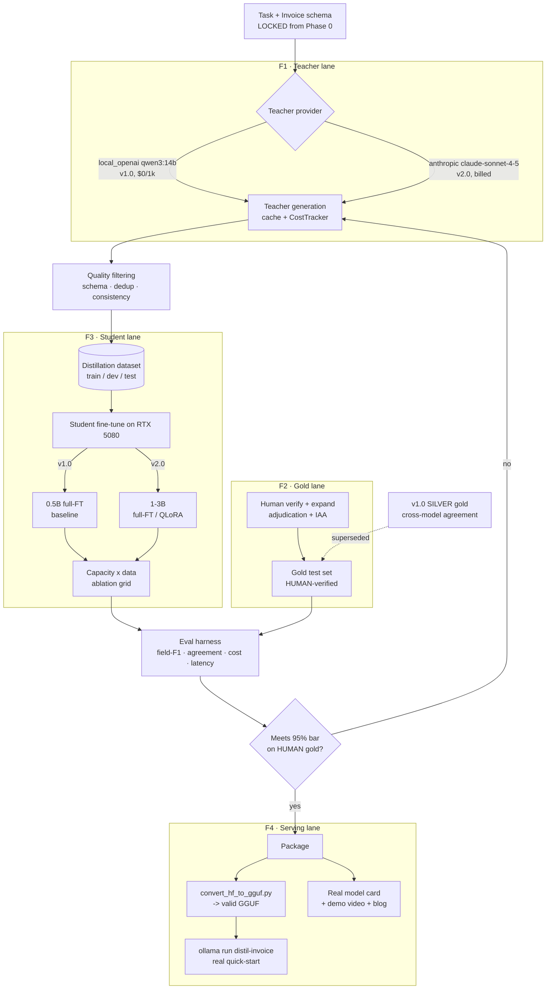
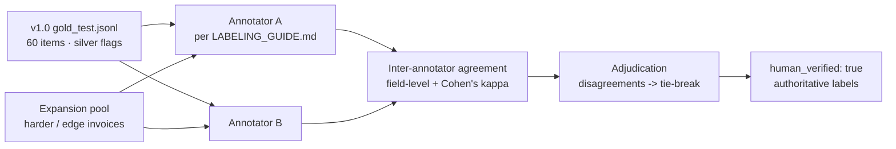
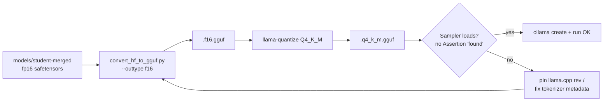

# 02 — Architecture (v2.0)

> What v2.0 *adds* to the v1.0 pipeline and — just as important — what it leaves untouched. The v1.0 architecture in [../02-architecture.md](../02-architecture.md) is the substrate; this doc describes the four additive changes (paid-teacher lane, human-gold lane, capacity-ablation lane, GGUF-serving lane), the new data flows, and the design decisions with their tradeoffs.

## Design stance: additive, not a rewrite

The v1.0 closed loop — *task → teacher generation → quality filtering → distillation dataset → student fine-tune → eval harness → quality gate → package* — is **kept whole**. Every v2.0 feature slots into an existing stage rather than replacing it:

| v2.0 feature | Slots into v1.0 stage | Mechanism already present? |
|---|---|---|
| **F1** paid frontier teacher | *Teacher generation* + *Cost* | Yes — `AnthropicTeacher`, disk cache, `CostTracker`, `price_table`, `cost_model.py` are built & tested; just never billed |
| **F2** human-verified gold | *Human-verified gold test set* | Partial — `LABELING_GUIDE.md`, `human_verified` flag, `evaluate.py --allow-unverified-gold` exist; adjudication/IAA are new |
| **F3** scale the student | *Student fine-tune* | Partial — `train.py` full-FT/QLoRA both exist; needs an offline 1–3B base + an ablation harness |
| **F4** valid GGUF + demo | *Package* | Partial — `export_ollama.py` writes the Modelfile + prints GGUF commands; the *verified* GGUF is new |

Nothing below changes `schema.py`, the metric `field_f1`, or the Phase 0 contract.

## v2.0 system overview

Compared with the v1.0 diagram, the four subgraphs are the only additions: a **branch** in the teacher lane, an **ablation grid** in the student lane, a **human-verification stage** that supersedes the silver gold, and a **verified-GGUF path** in the serving lane.

## Component walkthrough (v2.0 additions)

### F1 — Paid-teacher lane
The teacher is already provider-pluggable: `get_teacher(cfg, cache_dir)` reads `teacher.provider` and returns `AnthropicTeacher` or `LocalOpenAITeacher` (`src/distil_task/teacher.py`). v2.0 flips `provider: anthropic`, `model: claude-sonnet-4-5`, and sets `ANTHROPIC_API_KEY`. Three built-in mechanisms make this safe and cheap:

- **Content-addressed cache.** `_cache_key` hashes `(provider, model, system, prompt, temperature, max_tokens, salt)`; a re-run of the exact same labeling pass re-bills **$0**. The v1.0 labeling run already logged **600 cache hits out of 1000 calls** — that cache discipline is what makes a paid run affordable.
- **Cost accounting.** `CostTracker.record` multiplies real token usage by the `price_table` row (prefix-matched, so `claude-sonnet-4-5-20250929` hits `claude-sonnet-4-5`) and accumulates `usd` and `usd_per_1k_calls` into `reports/cost_teacher_labeling.json`.
- **Cost model.** `cost_model.params_from_config` builds `TeacherPricing` from the same price table; `teacher_cost_per_1k`, `cost_multiple`, and `break_even_requests_per_day` then produce the money-table numbers.

**Two sub-modes** (see [05-evaluation-metrics.md](05-evaluation-metrics.md)):
1. *Full re-distill* — re-label seeds with the paid teacher, re-train, re-eval. Cleanest; costs real tokens.
2. *Price-only* — keep the v1.0 student, but score the paid teacher on a sample to measure its real per-request tokens and feed the money table. Cheapest; proves the cost curve without a full re-run. The `teacher_avg_input_tokens (900)` / `teacher_avg_output_tokens (350)` config knobs exist precisely so measured averages can overwrite the placeholders.

### F2 — Human-gold lane
A new stage sits *upstream of the eval harness* and *supersedes* the silver gold:

- **Two-pass verification.** Each gold item is independently checked by two annotators against the raw invoice text, editing fields in place per [`data/gold/LABELING_GUIDE.md`](../../data/gold/LABELING_GUIDE.md), then flipping `human_verified: true`.
- **Adjudication.** Field-level disagreements are resolved by a documented tie-break rule (arithmetic-sanity checks from the guide: `sum(line totals) ≈ subtotal`, `subtotal + tax ≈ grand_total` within ±0.02; printed `grand_total` wins).
- **Agreement metric.** Inter-annotator agreement is reported (field-level exact/near-agreement and Cohen's κ on categorical fields like `currency`/`payment_terms`).
- **Expansion.** The set grows beyond 60 toward the SPEC's "a few hundred," deliberately seeded with harder/edge invoices to keep it ecologically valid.
- **Supersession.** `evaluate.py` already excludes non-human-verified items unless `--allow-unverified-gold`; once `human_verified` is populated, the silver `--silver-only` path is retired for the headline number and kept only as a labeled comparison row.

### F3 — Capacity-ablation lane
`scripts/train.py` already supports full-FT and QLoRA; v2.0 adds a **grid** driven by config overrides, not new training code:

| Base | Fit on 16 GB | Approach |
|---|---|---|
| Qwen2.5-0.5B (v1.0) | ✅ | full FT (baseline) |
| Qwen2.5-1.5B | ✅ | full FT |
| Qwen2.5-3B | ✗ full FT (~36 GB) → ✅ | **QLoRA** (4-bit) |

The **offline base copy** matters because the 3B download was the original blocker: bases are staged onto the GPU box out-of-band (see [04-data-and-resources.md](04-data-and-resources.md)). Each cell is trained on the *same* distillation data and scored on the *same* human gold set, plus a data-size sweep (e.g., 50% / 100% of train) so capacity and data effects are separable. Output is a table, not just a single checkpoint (see [05-evaluation-metrics.md](05-evaluation-metrics.md)).

### F4 — Verified-GGUF serving lane
`export_ollama.py` already: merges/re-serializes the student into `models/student-merged/`, writes a ChatML Modelfile carrying `STUDENT_SYSTEM_PROMPT` and the **exact training scaffold** (`<document>…</document>\nOutput:`), and prints the `convert_hf_to_gguf.py` + `llama-quantize` commands. What is missing is a **verified** GGUF:

The known failure mode is recorded in the script: Ollama's *built-in* converter produced a GGUF that tripped llama.cpp's sampler (`Assertion 'found' … llama-sampling.cpp:660`). F4's job is to get a clean conversion via llama.cpp's own `convert_hf_to_gguf.py`, verify the sampler loads, and wire `serve/infer.py`'s constrained-output loop over the GGUF for programmatic use.

## New data flows

**F1 paid-generation flow:**
`seeds → AnthropicTeacher (billed, cached) → CostTracker → reports/cost_teacher_labeling.json → filter → splits → SFT → eval → money_table.md (cost_multiple > 1)`

**F2 gold-verification flow:**
`gold_test.jsonl (silver) → 2× human annotation → IAA → adjudication → human_verified:true → evaluate.py (headline field-F1 on human gold)`

**F3 ablation flow:**
`fixed distillation data × {0.5B, 1.5B, 3B} × {50%, 100% data} → checkpoints → evaluate.py per cell → capacity×data table`

**F4 serving flow:**
`student-merged → convert_hf_to_gguf.py → llama-quantize → sampler-verify → ollama create → ollama run "<invoice>" → schema-valid JSON`

## Key design decisions & tradeoffs

### Keep the local teacher; add the paid one (not replace)
- **Decision.** F1 *adds* the `anthropic` path; `local_openai` (`qwen3:14b`) stays a first-class option.
- **Tradeoff.** A paid teacher unlocks the dollar thesis but costs real money and reintroduces a ToS/egress surface; the local teacher keeps the privacy/offline story. Supporting both is nearly free because the client is already provider-pluggable — so we keep both and let the config choose.

### Price-only vs full re-distill
- **Decision.** Offer both; default to **price-only** to *prove the cost curve* before committing tokens to a **full re-distill** that could also *improve quality*.
- **Tradeoff.** Price-only is cheap and isolates the cost claim but leaves the student trained on the local teacher's labels; full re-distill is the honest end-state (paid teacher → paid-teacher student → paid-teacher parity) but costs the most. Sequencing price-only first de-risks the spend.

### Human gold supersedes silver (not deletes it)
- **Decision.** Human labels become the headline; the silver number is retained as a **labeled comparison row**, not discarded.
- **Tradeoff.** Keeping silver invites "which number is real?" confusion, mitigated by always labeling grade; the upside is a visible before/after that *shows* the circularity being removed — itself part of the honesty story.

### Scale via QLoRA at 3B rather than forcing full FT
- **Decision.** 1.5B stays full FT; 3B uses **QLoRA (4-bit)** to fit 16 GB (a 3B full FT needs ~36 GB, per the config comment).
- **Tradeoff.** QLoRA adds adapter-merge steps and a small quality/complexity cost, but it is the only way a 3B student fits the single-GPU constraint — and `export_ollama.py` already handles the merge path.

### Verify the GGUF against the sampler, not just "it converted"
- **Decision.** A GGUF counts as done only when llama.cpp's sampler loads it without the `Assertion 'found'` crash and produces schema-valid JSON.
- **Tradeoff.** Stricter Definition of Done costs an extra verification loop, but a GGUF that converts yet crashes at inference is worthless for the "one-command run" deliverable — so the sampler check is non-negotiable.

## Related docs
- The v1.0 architecture this extends: [../02-architecture.md](../02-architecture.md)
- Requirements per feature: [03-requirements.md](03-requirements.md)
- Resources each lane needs (bases, keys, hardware): [04-data-and-resources.md](04-data-and-resources.md)
- Metrics, the money table, and the ablation table: [05-evaluation-metrics.md](05-evaluation-metrics.md)
- Sequencing and Definition of Done: [07-build-roadmap.md](07-build-roadmap.md)
