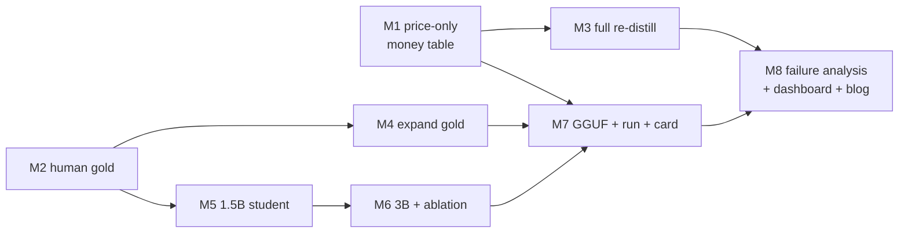

# 07 — Build Roadmap (v2.0)

> The executable Phase 2 plan: ordered milestones M1–M8, each with objective, key tasks, a Definition of Done, effort/impact, and its dependencies. This mirrors the Phase 0–4 structure of [../07-build-roadmap.md](../07-build-roadmap.md) but is sequenced by *dependency and risk-retirement*, cheapest-highest-leverage first.

## At a glance

| Milestone | Feature | Objective | Effort | Impact | Depends on |
|---|---|---|---|---|---|
| **M1** | F1 | Price-only: measured paid-teacher token profile → dollar money table | **S** | **Critical** | — |
| **M2** | F2 | Human-verify the existing 60-item gold set + IAA | **M** | **Critical** | — |
| **M3** | F1 | Full re-distill from the paid teacher (optional but honest end-state) | M | High | M1 |
| **M4** | F2 | Expand gold toward a few hundred (edge cases) | M | High | M2 |
| **M5** | F3 | Stage offline bases; train the 1.5B student | M | High | M2 (human gold) |
| **M6** | F3 | 3B QLoRA + capacity×data ablation table | **L** | Medium | M5 |
| **M7** | F4 | Valid GGUF + `ollama run` + real model card | M | **Critical** | best student from M5/M6 |
| **M8** | X | Refreshed failure analysis + dashboard + demo video + blog | S | High | M1–M7 |

*Effort: S ≈ hours, M ≈ a few days, L ≈ a week. Impact = on the credibility of the headline claim.*

## Sequencing rationale

- **M1 first** because it is the *cheapest path to the whole thesis*: the cost plumbing already exists, so a small price-only run turns `cost_multiple = 0` into a real dollar win in hours. It retires the project's biggest credibility risk before spending on anything else.
- **M2 in parallel** because human verification is human-bound (annotator time), not compute-bound, and gates every headline quality number downstream.
- **M3/M4** deepen F1/F2 once their cheap versions have proven out.
- **M5 before M6** because a full-FT 1.5B is simpler than 3B QLoRA and answers most of the capacity question; M6 completes the grid.
- **M7 uses the winning student** from the ablation, so it waits on M5/M6.
- **M8 last** because it narrates measured results.

## M1 — Price-only paid-teacher money table (F1)

**Objective.** Prove the dollar cost win with minimal spend: measure the paid teacher's real per-request token profile and fill the money table — without a full re-distill.

**Key tasks.**
- Set `provider: anthropic`, `model: claude-sonnet-4-5`, export `ANTHROPIC_API_KEY`.
- Score the paid teacher on a small invoice sample (e.g. 30–50) to measure real avg input/output tokens; overwrite `teacher_avg_input_tokens` / `teacher_avg_output_tokens`.
- Run `evaluate.py` so `cost_model` emits `teacher $/1k`, `cost_multiple`, break-even.
- Verify `reports/cost_teacher_labeling.json` shows `total_usd > 0`.

**Definition of Done.**
- Money table shows `cost_multiple > 1` and a non-null break-even/day.
- The number is computed from *measured* paid-teacher tokens, not the config placeholders.
- Cache verified (a re-run re-bills $0).

**Effort S · Impact Critical.**

## M2 — Human-verify the 60-item gold set (F2)

**Objective.** Remove the silver circularity for the headline number.

**Key tasks.**
- ≥ 2 annotators independently verify all 60 items per `LABELING_GUIDE.md`, editing fields in place, flipping `human_verified: true`.
- Compute IAA (field-level agreement + Cohen's κ) via the new `04_gold_iaa.py`.
- Adjudicate disagreements by the documented protocol; remove broken docs to `gold_removed.txt`.
- Re-run `evaluate.py` (default: `allow_unverified_gold: false`) for the human headline field-F1.

**Definition of Done.**
- Scored items are `human_verified: true`; `eval_report.json` reports a human grade.
- IAA reported (target categorical κ ≥ 0.8).
- Headline field-F1 ≥ 95% of teacher on human gold (or a concrete iteration plan if it dips).
- Silver number retained as a labeled comparison row.

**Effort M · Impact Critical.**

## M3 — Full re-distill from the paid teacher (F1, optional)

**Objective.** The honest end-state: a student trained on the *paid* teacher's labels, so parity is paid-teacher-vs-paid-teacher-student.

**Key tasks.**
- Re-label the seed set with the paid teacher (cache makes re-runs free); re-filter, re-split.
- Retrain the student; re-evaluate on the human gold set.
- Compare paid-teacher-student vs local-teacher-student quality and cost.

**Definition of Done.**
- A student checkpoint distilled from the paid teacher, scored on human gold, meets the bar.
- Cost report reflects the real full-run spend.

**Effort M · Impact High.** (Skippable if budget-bound: M1 already proves the cost curve.)

## M4 — Expand the gold set (F2)

**Objective.** Grow gold toward the SPEC's "few hundred," weighted to edge cases, keeping it leak-free.

**Key tasks.**
- Source harder invoices (multi-currency, foreign dates, discounts/shipping, missing tax, fractional qty).
- Dedup against train/dev/test (threshold 0.90); human-verify + adjudicate.

**Definition of Done.**
- Expanded human gold set, `cross_split_leaks: 0` preserved, edge-case coverage documented.

**Effort M · Impact High.**

## M5 — Train the 1.5B student (F3)

**Objective.** Get a student into the SPEC's 1–3B band, on the single GPU.

**Key tasks.**
- Stage `Qwen2.5-1.5B-Instruct` offline; point `training.base_model` at the local path.
- Full FT on the fixed distillation data; evaluate on human gold.

**Definition of Done.**
- A 1.5B checkpoint + `training_recipe.json`; scored on human gold; latency/throughput recorded.
- field-F1 and exact-match reported vs the 0.5B baseline (0.9647 / 54.1%).

**Effort M · Impact High.**

## M6 — 3B QLoRA + the ablation table (F3)

**Objective.** Complete the capacity×data grid and quantify the gap size closes.

**Key tasks.**
- 3B via 4-bit QLoRA (`full_finetune: false`); merge via `export_ollama.py`.
- Run the {0.5B, 1.5B, 3B} × {≥2 data fractions} grid on identical data + human gold.
- Assemble the ablation table (field-F1, exact-match, p95, footprint per cell).

**Definition of Done.**
- Ablation table filled; the size-vs-data split for exact-match is stated explicitly.
- Deployed student selected on a documented quality/latency/footprint tradeoff.

**Effort L · Impact Medium** (field-F1 headroom is small; exact-match is the real prize).

## M7 — Valid GGUF + one-command run + real card (F4)

**Objective.** Make the deliverable actually runnable.

**Key tasks.**
- Merge the winning student; convert via pinned llama.cpp `convert_hf_to_gguf.py`; quantize (Q4_K_M).
- Verify the sampler loads it (no `Assertion 'found'` crash); `ollama create` + `ollama run` on a real invoice.
- Wire `serve/infer.py` over the GGUF for schema-enforced calls.
- Replace the TRL stub model card with a real invoice card (recipe, eval table, quick-start, license).

**Definition of Done.**
- `ollama run distil-invoice "<invoice>"` returns schema-valid JSON from a clean machine.
- Real model card committed; stub removed.

**Effort M · Impact Critical.**

## M8 — Failure analysis, dashboard, demo, blog (X)

**Objective.** Package the measured story honestly.

**Key tasks.**
- Re-categorize the residual gap on human gold (exact-match miss clusters) from `gold_predictions.jsonl`.
- Point the Streamlit dashboard at the new `eval_report.json`; confirm the break-even crossover renders.
- Record the demo video; write the blog with the measured `N×` and human-gold parity.

**Definition of Done.**
- Failure analysis names which cases still need the teacher.
- Dashboard shows the real crossover; demo + blog published.

**Effort S · Impact High.**

## Milestone → requirement traceability

| Milestone | Satisfies |
|---|---|
| M1, M3 | F1-FR-1…6, NFR-C1/C2 |
| M2, M4 | F2-FR-1…7, NFR-Q1/Q2 |
| M5, M6 | F3-FR-1…6, NFR-H1/L1 |
| M7 | F4-FR-1…4, NFR-R1 |
| M8 | F4-FR-5/6, X-FR-1/2 |

## Related docs
- What each milestone delivers: [03-requirements.md](03-requirements.md)
- How each is measured: [05-evaluation-metrics.md](05-evaluation-metrics.md)
- Setup before M1/M5/M7: [06-environment-setup.md](06-environment-setup.md)
- Risks per milestone: [08-risks-pitfalls.md](08-risks-pitfalls.md)
- The v1.0 phases this continues: [../07-build-roadmap.md](../07-build-roadmap.md)
